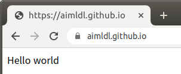
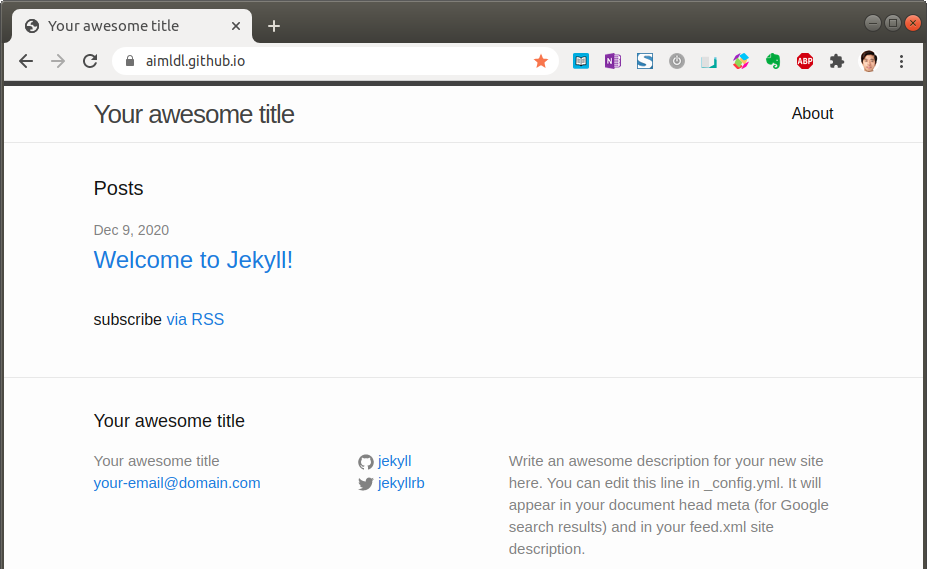
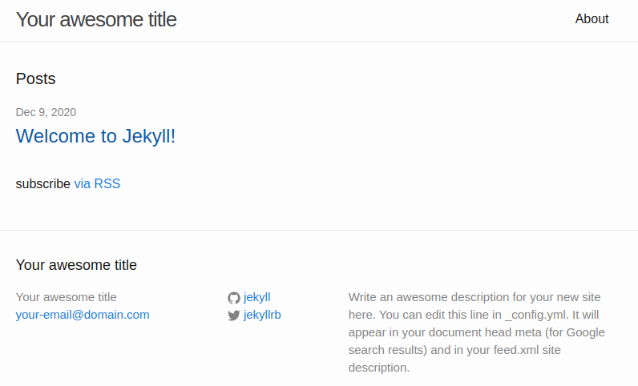
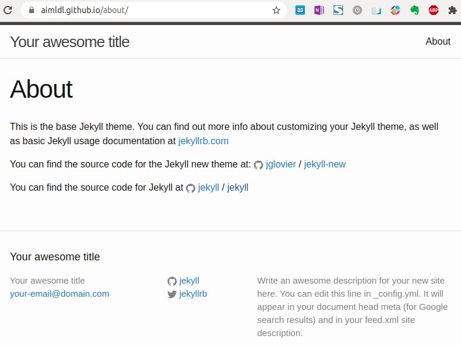
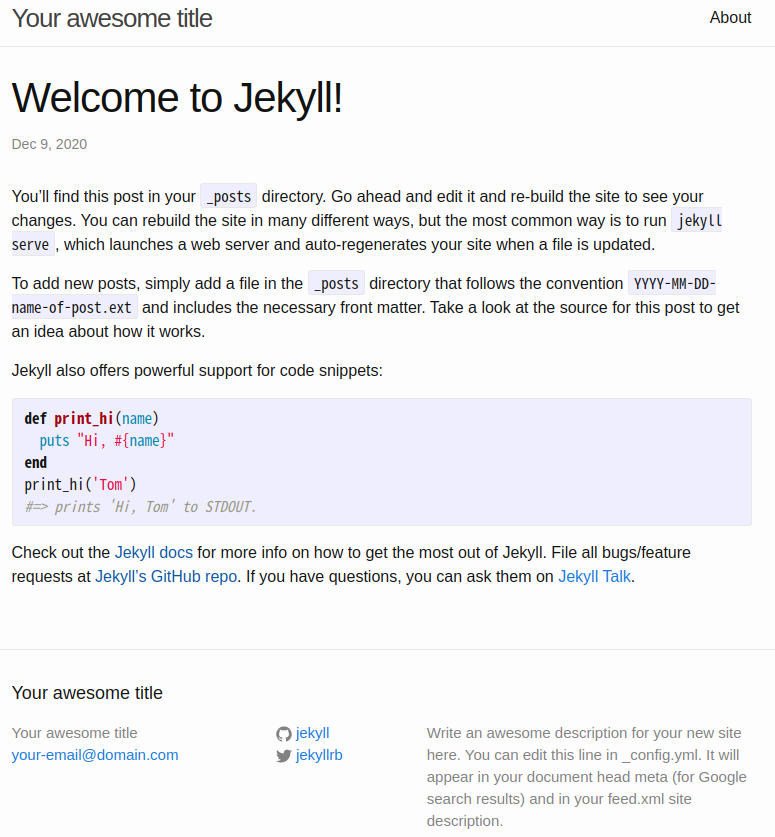
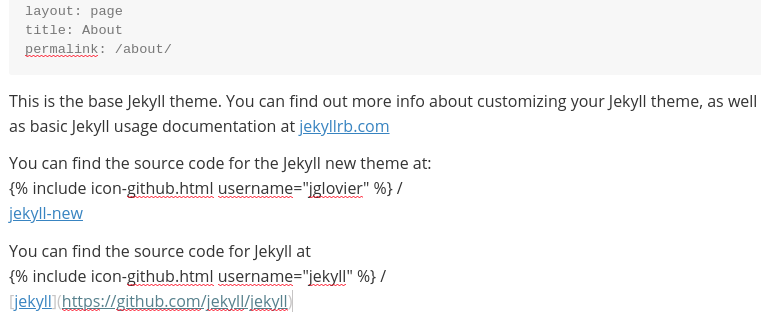
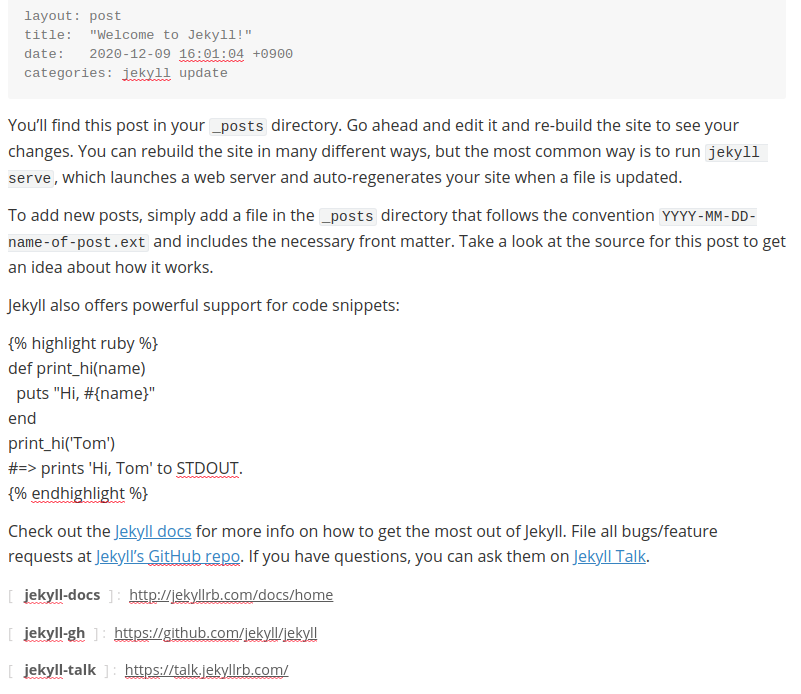

* Rev.1: 2020-12-10 (Thu)
* Draft: 2020-05-25 (Mon)
# How to create a web site on Github with Jekyll (1)
## Overview

This is a series of blog posts:

* How to create a web site on Github with Jekyll (1)
* How to create a web site on Github with Jekyll (2)
* How to create a web site on Github with Jekyll (3)

https://jekyllrb-ko.github.io/


## Websites for you and your projects

* For details, see https://pages.github.com/

Note directory `~/github` has already been created.

```bash
$ cd ~/github
$ git clone https://github.com/aimldl/aimldl.github.io
$ cd aimldl.github.io/
$ echo "Hello World" > index.html
$ git add --all
$ git commit -m "Initial commit"
$ git push
Username for 'https://github.com': aimldl
Password for 'https://aimldl@github.com': 
  ...
$
```

Open a browser and go to https://aimldl.github.io/.



## [Blogging with Jekyll](https://help.github.com/articles/using-jekyll-with-pages)

Using [Jekyll](https://jekyllrb.com/), you can blog using beautiful Markdown syntax, and without having to deal with any databases. [Showcase](https://jekyllrb.com/showcase/) presents some company websites powered by Jekyll. Some of my favorite samples are below.


A part of `GETTING STARTED` at https://jekyllrb.com/docs/ is summarized below.

- [Quickstart](https://jekyllrb.com/docs/)
- [Installation](https://jekyllrb.com/docs/installation/)
- [Ruby 101](https://jekyllrb.com/docs/ruby-101/)
- [Step by Step Tutorial](https://jekyllrb.com/docs/step-by-step/01-setup/)

### [Ruby 101](https://jekyllrb.com/docs/ruby-101/)

> Jekyll is written in Ruby. If you’re new to Ruby, this page helps you learn some of the terminology.
>
> **Gems** are code you can include in Ruby projects. 
>
>
> A **Gemfile** is a list of gems used by your site. Every Jekyll site has a Gemfile in the main folder.
>
> **Bundler** is a gem that installs all gems in your Gemfile.
>
> For details, see [Ruby 101](https://jekyllrb.com/docs/ruby-101/).
>
> Bundler provides a consistent environment for Ruby projects by tracking and installing the exact gems and versions that are needed. Bundler is an exit from dependency hell, and ensures that the gems you need are present in development, staging, and production. Starting work on a project is as simple as `bundle install`.
>
> For details, refer to https://bundler.io/.

### [Learn how to set up Jekyll](https://jekyllrb.com/docs/)

#### [Instructions](https://jekyllrb.com/docs/#instructions)

##### 1. Install all [prerequisites](https://jekyllrb.com/docs/installation/) 

Install the prerequisites on the machine where `git clone` has been executed. For example, my machine is a desktop with Ubuntu 18.04.

**Ruby**

```bash
$ sudo apt install -y ruby
```

RubyGems, GCC, and Make are preinstalled with Ubuntu 18.04. To verify, run:

```bash
$ gem -v  
$ gcc -v
$ g++ -v
$ make -v
```

##### 2. Install the jekyll and bundler.

Before installing `jekyll` and `bundler`, configure `GEM_HOME`. For details, see [Appendix A](appendix_a.md).

```bash
# Run these commands first
$ mkdir ~/.ruby
$ echo 'export GEM_HOME=~/.ruby/' >> ~/.bashrc
$ echo 'export PATH="$PATH:~/.ruby/bin"' >> ~/.bashrc
$ source ~/.bashrc
# Command in the instructions is changed
$ sudo apt install -y jekyll bundler
```

Notice the original command `gem install jekyll bundler` has been changed to `sudo apt install -y jekyll bundler`.  

##### 3. Create a new Jekyll site at ./myblog

```bash
$ jekyll new myblog
New jekyll site installed in /home/aimldl/github/aimldl.github.io/myblog.
$
```

##### 4. Change into your new directory.

```bash
$ cd myblog
```

##### 5. Build the site and make it available on a local server.

[Appendix. B](appendix_b.md) explains why the first two commands are added to the original command in the instructions.

```bash
# Initialize bundle and add jekyll first
$ bundle init
$ bundle add jekyll
# And then run the command in the insturctions
$ bundle exec jekyll serve
```

The message is

```bash
  ...
Auto-regeneration: enabled for '/home/aimldl/github/aimldl.github.io/myblog'
    Server address: http://127.0.0.1:4000/
  Server running... press ctrl-c to stop.
```

If the following error occurs, run `bundle install` and then run `bundle exec jekyll serve` again.

```bash
$ bundle exec jekyll serve
Could not find public_suffix-4.0.6 in any of the sources
Run `bundle install` to install missing gems.
$ bundle install
  ...
HEADS UP! i18n 1.1 changed fallbacks to exclude default locale.
But that may break your application.

If you are upgrading your Rails application from an older version of Rails:

Please check your Rails app for 'config.i18n.fallbacks = true'.
If you're using I18n (>= 1.1.0) and Rails (< 5.2.2), this should be
'config.i18n.fallbacks = [I18n.default_locale]'.
If not, fallbacks will be broken in your app by I18n 1.1.x.

If you are starting a NEW Rails application, you can ignore this notice.

For more info see:
https://github.com/svenfuchs/i18n/releases/tag/v1.1.0
$
```


##### 6. Browse to http://localhost:4000

Open a web browser and go to either:

* http://localhost:4000
* http://127.0.0.1:4000/

Note `localhost` is equivalent to `127.0.0.1`.


Later, I found the following article and present it for future reference.

[Troubleshooting 3 issues when configuring Jekyll on Github Pages](https://medium.com/@khwongk12/troubleshooting-3-issues-when-configuring-jekyll-on-github-pages-5d882585c6f5), medium

## The new website in action!

So far `index.html` is the hello world page.


I've moved all the files in the `myblog` directory to the parent directory.

```bash
~/github/aimldl.github.io$ ls
Gemfile       _config.yml  _layouts  _sass  about.md  feed.xml    js
Gemfile.lock  _includes    _posts    _site  css       index.html
~/github/aimldl.github.io$
```

In this process, the old hello world `index.html` is removed and the `Your awesome title` page has become the new `index.html`.


And then pushed this repository to github.

```bash
~/github/aimldl.github.io$ git add .
~/github/aimldl.github.io$ git commit -m 'Add jekyll for the first time'
~/github/aimldl.github.io$ git push
```

After waiting  a while, go to the website `aimldl.github.io` and saw the new index page in action!




## Running the local server

All the files in the `myblog` are moved to the parent directory, specifically `~/github/aimldl.github.io`. The server can be executed with the same command as follows.

```bash
~/github/aimldl.github.io$ bundle exec jekyll serve
Configuration file: /home/aimldl/github/aimldl.github.io/_config.yml
            Source: /home/aimldl/github/aimldl.github.io
       Destination: /home/aimldl/github/aimldl.github.io/_site
 Incremental build: disabled. Enable with --incremental
      Generating... 
                    done in 0.149 seconds.
 Auto-regeneration: enabled for '/home/aimldl/github/aimldl.github.io'
    Server address: http://127.0.0.1:4000/
  Server running... press ctrl-c to stop.
```


## Jekyll

### Sample website

Let's see what the sample website looks like. There are pages and posts.

* Examples of pages include:
  * index.html
  * _site/about/index.html

* An example of a post is:
  * Welcome to Jekyll!

#### `index.html`

`index.html` is the first page for a website. In my case, `index.html` is open when I go to https://aimldl.github.io.



#### _site/about/index.html

When I go to https://aimldl.github.io/about/, the page in `_site/about/index.html` is open.



##### Welcome to Jekyll!

This post is an example of posts.




### Source files

Source files are in the form of HTML (`.html`) or markdown (`.md` or `.markdown`). Jekyll compiles, builds, or renders markdown files into HTML files. 

`.md`→ `.html`

`.markdown`→ `.html`

The built files are stored under `_site`. The default tree structure is:

```bash
_site
├── about
├── css
├── images
├── jekyll
└── js

```

For details, refer to [Jekyll > DOCS > GETTING STARTED > Step by Step Tutorial > Build](https://jekyllrb.com/docs/step-by-step/01-setup/#build).

### Source files

#### index.html

```bash
---
layout: default
---
<div class="home">
  <h1 class="page-heading">Posts</h1>
  <ul class="post-list">
    
      <li>
        <span class="post-meta">{{ post.date | date: "%b %-d, %Y" }}</span>
        <h2>
          <a class="post-link" href="{{ post.url | prepend: site.baseurl }}">{{ post.title }}</a>
        </h2>
      </li>
    
  </ul>
  <p class="rss-subscribe">subscribe <a href="{{ "/feed.xml" | prepend: site.baseurl }}">via RSS</a></p>
</div>
```

#### about.md →_site/about/index.html




##### _posts/2020-12-09-welcome-to-jekyll.markdown



### [Step by Step Tutorial](https://jekyllrb.com/docs/step-by-step/01-setup/)

https://jekyllrb.com/docs/step-by-step/01-setup/

1. [Setup](https://jekyllrb.com/docs/step-by-step/01-setup/)
2. [Liquid](https://jekyllrb.com/docs/step-by-step/02-liquid/)
3. [Front Matter](https://jekyllrb.com/docs/step-by-step/03-front-matter/)
4. [Layouts](https://jekyllrb.com/docs/step-by-step/04-layouts/)
5. [Includes](https://jekyllrb.com/docs/step-by-step/05-includes/)
6. [Data Files](https://jekyllrb.com/docs/step-by-step/06-data-files/)
7. [Assets](https://jekyllrb.com/docs/step-by-step/07-assets/)
8. [Blogging](https://jekyllrb.com/docs/step-by-step/08-blogging/)
9. [CollectionsBuild ](https://jekyllrb.com/docs/step-by-step/09-collections/)
10. [Deployment](https://jekyllrb.com/docs/step-by-step/10-deployment/)

## Adding pages and posts

Jekyll is designed to help creating a website easily. A website consists of several pages and posts. Steps to create pages and posts are quite easy as long as you are familiar with markdown.

### Steps to create and edit pages and posts

#### Step 1. Write text files in the markdown format.

#### Step 2. Run a local web server.

```bash
$ bundle exec jekyll server
```

 Note: The assumption is the `jekyll server` is installed properly.

#### Step 3. Render the markdown files into HTML files and so on.

The following two commands build the site and outputs a static site to directory `_site`.

* `$ jekyll build`
* `$ jekyll serve`

For details, refer to [Jekyll > DOCS > GETTING STARTED > Step by Step Tutorial > Build](https://jekyllrb.com/docs/step-by-step/01-setup/#build).

#### Step 4. Verify the rendered result at `http://localhost:4000`.

### Example to add a page or a post

The best way to learn how to add a page or post by example. For details, refer to:

*  [Jekyll > DOCS > CONTENT > Pages](https://jekyllrb.com/docs/pages/)
*  [Jekyll > DOCS > CONTENT > Posts](https://jekyllrb.com/docs/posts/)

#### Adding a page: `Contact`

Step 1. Create a file`contact.md` under the project root directory. 

In my case, the directory is where files like `README.md`, `index.html`, and `about.md` reside.

Step 2. Add the YAML front matter. For example,

```text
---
layout: page
title: Contact
permalink: /contact/
---
```

Step 3. Add the content of the page. For example,

```text
Work
Affiliation Name<br />
Address<br />
Phone number<br />
Email address
```

The full text file is:

```text
---
layout: page
title: Contact
permalink: /contact/
---
Work
Affiliation Name<br />
Address<br />
Phone number<br />
Email address
```

Step 4. Run the local web server.

Go to `http://localhost:4000' on a web browser.

Step 5. Check the homepage. You should see `Contact` next to `About`.


Step 5. Click the create page.

In this example, click `Contact` and the following page shows up.


#### Adding an image (to the page)

Say you want to add an image file `photo-t-bamboo_forest.jpg` to `Contact` page.

Step 1. Create a directory `assets` and its sub-directory `images`.

Step 2. Move the image file to the sub-directory `assets/images`.

```bash
assets/
└── images
    └── photo-t-bamboo_forest.jpg
```

Step 3. Reference the path to the image file in the markdown file `contact.md`.

```text
``
```

**Caution: Start the path to the image file from `/` indicating the project root.**

```text
Correct: ``
Wrong: ``
```

* The path starts without `/`
  * NOT right.
    * although the program like `Typora` shows the image. 
    * The link to the image file is broken on the web site.
* The path starts with `/`
  *  This is right.
    * The link is broken on a program like `Typora`.
    * But the image is shown on the web site.

The full text of `contact.md` is:

```text
---
layout: page
title: Contact
permalink: /contact/
---


Work
Affiliation Name<br />
Address<br />
Phone number<br />
Email address
```

The rendered page is:


### Adding a post

A blog post is created by adding a markdown file to sub-directory `_posts`. For details, refer to  [Jekyll > DOCS > CONTENT > Creating Posts](https://jekyllrb.com/docs/posts/#creating-posts).

#### The file name convention

```text
YEAR-MONTH-DAY-title.MARKUP
```

Examples of valid post filenames include

```text
2011-12-31-new-years-eve-is-awesome.md
2012-09-12-how-to-write-a-blog.md
```

In this example,

```text
2020-12-10-this-is-the-title.md
```

#### Start with YAML front matter

```text
---
layout: post
title:  "This is the title"
---
```

For details, refer to  [Jekyll > DOCS > CONTENT > Front matter](https://jekyllrb.com/docs/front-matter/).

#### Add the content with the markdown format

```text
# Heading 1
## Heading 2
Write down more things below.
```

#### Rendered page

Simply adding a markdown file `2020-12-10-this-is-the-title.md` to directory `_posts` is enough to create a post.


The directory and file structure for the above posts is below.


Click the created post `This is the title`.


## Next

* [How to create a web site on Github with Jekyll (2)]()