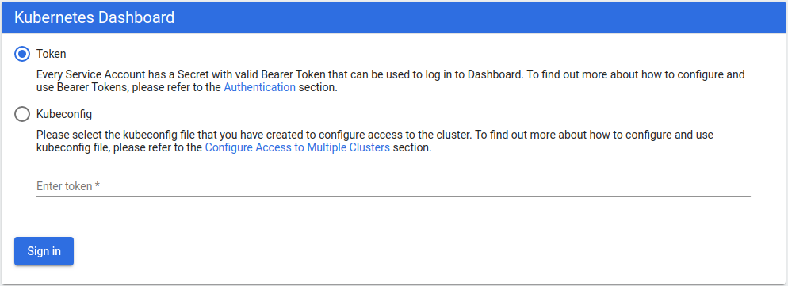
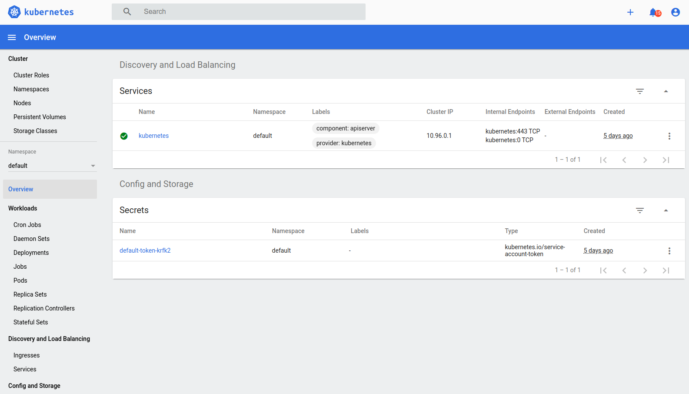
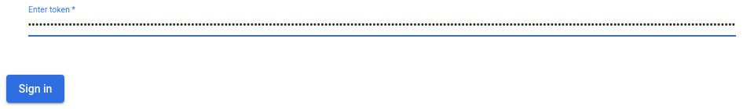
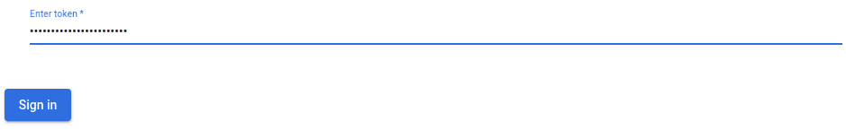
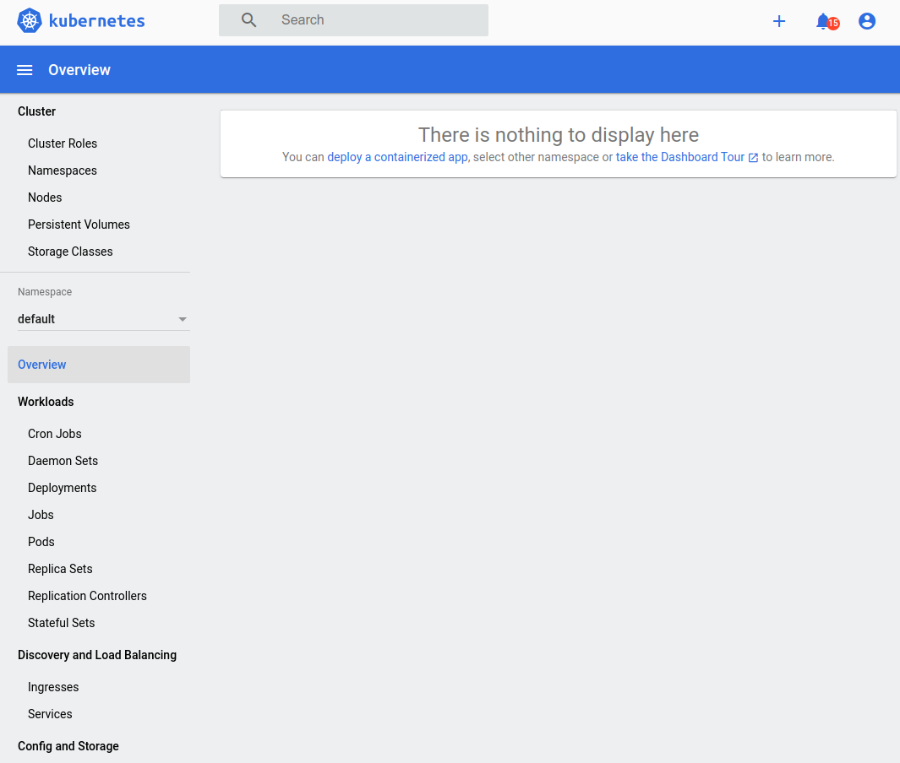

* Draft: 2020-07-07 (Tue)

# 쿠버네티스 대쉬보드 설치하기

## 개요

* 쿠버네티스 대시보드 (Kubernetes Dashboard)는 관리를 위한 웹UI입니다. 

* 커맨드 라인용 UI인 k9s 명령어도 있습니다.
* 대시보드와 k9s 모두 설치하면 편리합니다.

## 요약

로컬 컴퓨터, 즉 베어 메탈, 에 있는 쿠버네티스 클러스터에 대쉬보드를 설치합니다.

```bash
$ kubectl apply -f https://raw.githubusercontent.com/kubernetes/dashboard/v2.0.0/aio/deploy/recommended.yaml
```

토큰을 확인합니다.

```bash
$ kubectl -n kube-system describe $(kubectl -n kube-system \
>     get secret -n kube-system -o name | grep namespace) | grep token
$
```

대쉬보드를 실행합니다.

```bash
$ kubectl proxy
```

웹브라우저의 주소창에 아래 주소를 입력합니다.

http://localhost:8001/api/v1/namespaces/kubernetes-dashboard/services/https:kubernetes-dashboard:/proxy/#!/login



토큰 값을 입력하고 `Sign in`버튼을 누릅니다.



대시보드의 내용을 훑어봅니다. 

아래에서는 동일한 내용을 보다 자세히 설명합니다.

## 설치 (Deployment) 하기

일반적으로 쿠버네티스 클러스터에 설치할 때는 아래와 같은 명령어를 실행합니다.

```bash
$ kubectl apply -f [manifest]
```

쿠버네티스 대쉬보드의 매니페스트는 

```text
https://raw.githubusercontent.com/kubernetes/dashboard/v2.0.3/aio/deploy/recommended.yaml
```

입니다. 최신 버전을 설치하기 위해선 [GitHub의 Kubernetes Dashboard 페이지](https://github.com/kubernetes/dashboard)의 명령어를 확인하세요. 위의 매니페스트와 버전이 다를 수 있습니다.

마스터에서 다음 명령어를 실행하면 설치가 진행됩니다.

```bash
$ kubectl apply -f https://raw.githubusercontent.com/kubernetes/dashboard/v2.0.3/aio/deploy/recommended.yaml
```

설치 시 출력 메세지는

```bash
namespace/kubernetes-dashboard created
serviceaccount/kubernetes-dashboard created
service/kubernetes-dashboard created
secret/kubernetes-dashboard-certs created
secret/kubernetes-dashboard-csrf created
secret/kubernetes-dashboard-key-holder created
configmap/kubernetes-dashboard-settings created
role.rbac.authorization.k8s.io/kubernetes-dashboard created
clusterrole.rbac.authorization.k8s.io/kubernetes-dashboard created
rolebinding.rbac.authorization.k8s.io/kubernetes-dashboard created
clusterrolebinding.rbac.authorization.k8s.io/kubernetes-dashboard created
deployment.apps/kubernetes-dashboard created
service/dashboard-metrics-scraper created
deployment.apps/dashboard-metrics-scraper created
$
```

와 같습니다. 

## 설치 확인하기

대쉬보드의 설치여부를 확인하기 위해 전체 네임스페이스의 파드의 리스트를 확인하면, 새로 두 개의 파드가 추가 되었음을 알 수 있습니다.

```bash
$ kubectl get pods --all-namespaces
NAMESPACE              NAME                                            READY   STATUS    RESTARTS   AGE
  ...
kubernetes-dashboard   dashboard-metrics-scraper-6b4884c9d5-r6fzx      1/1     Running   0          24h
kubernetes-dashboard   kubernetes-dashboard-7b544877d5-bldt8           1/1     Running   0          24h
$
```

## 대쉬보드에 접속하기

대쉬보드에 로그인하기 위해 ID와 Password를 쓰는 대신 인증 토큰 (Authentication Token)을 이용합니다.

### Step 1. 마스터에서 기존 토큰 값을 확인합니다.

```bash
$ kubectl -n kube-system describe $(kubectl -n kube-system \
>     get secret -n kube-system -o name | grep namespace) | grep token
Name:         namespace-controller-token-g85r7
Type:  kubernetes.io/service-account-token
token:      a ... z
$
```

위의 예에서  `a ... z`로 표기된 token값을 복사합니다.

### Step 2. `kubectl proxy` 명령어로 대쉬보드를 실행합니다.

```bash
$ kubectl proxy
Starting to serve on 127.0.0.1:8001
```

대쉬보드 서버를 `127.0.0.1`의 `8001`포트로 접속할 수 있게 했습니다. 즉, 대쉬보드는 이 명령어가 실행된 컴퓨터에서만 접속할 수 있습니다. 외부에서 접속하려면 DNS 등의 설정을 별도로 해줘야합니다.

### Step 3. 웹 브라우저의 주소창에 다음 링크를 입력합니다.

```text
http://localhost:8001/api/v1/namespaces/kubernetes-dashboard/services/https:kubernetes-dashboard:/proxy/#!/login
```


### Step 4. 인증 토큰으로 대쉬보드에 접속합니다. 

토큰 값을 붙여넣기/입력하고, `Sign in`버튼을 누릅니다.



`Sign in`버튼을 누르면 대시보드의 메인 화면이 나옵니다. 


### Step 5. 대시보드 훑어보기

대시보드 사용에 대한 자세한 내용은 [kubernetes/dashboard의 GitHub 프로젝트 문서](https://github.com/kubernetes/dashboard)를 참고하세요.

## 참고 문서

* [Kubernetes Dashboard](https://github.com/kubernetes/dashboard), kubernetes/dashboard 공식 github repository
* [Web UI (Dashboard)](https://kubernetes.io/docs/tasks/access-application-cluster/web-ui-dashboard/), 쿠버네티스 공식 문서
* [자습서: Kubernetes 웹 UI 배포(대시보드)](https://docs.aws.amazon.com/ko_kr/eks/latest/userguide/dashboard-tutorial.html), Amazon EKS 사용 설명서

## 부록: 

`kubeadm token list`명령어를 다시 실행하면 신규 생성된 토큰에 대한 정보가 보입니다.

```bash
$ kubeadm token list
TOKEN                    TTL  EXPIRES                    ...  EXTRA GROUPS
qioqmq.phvo5rml0cy4bctd  23h  2020-07-09T14:22:55+09:00  ...  system:bootstrappers:kubeadm:default-node-token
$
```


`kubeadm token list`명령어를 다시 실행하면 신규 생성된 토큰에 대한 정보가 보입니다.

```bash
$ kubeadm token list
TOKEN                    TTL  EXPIRES                    ...  EXTRA GROUPS
qioqmq.phvo5rml0cy4bctd  23h  2020-07-09T14:22:55+09:00  ...  system:bootstrappers:kubeadm:default-node-token
$
```

```bash
$ kubeadm token list
```

없다면 새로 만듭니다. 생성된 토큰은 24시간 후에 소멸됩니다.

```bash
$ kubeadm token create
qioqmq.phvo5rml0cy4bctd
$
```




